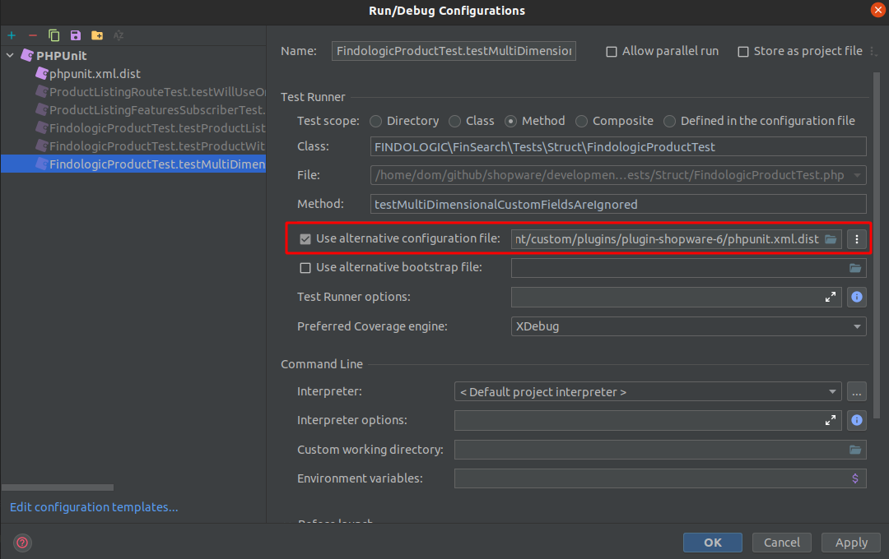

# FINDOLOGIC Shopware 6 Plugin

[](https://github.com/findologic/plugin-shopware-6/actions)

Official Findologic plugin for Shopware 6.

## Installation

### Production

Please see [our Shopware 6 documentation](https://docs.findologic.com/doku.php?id=integration_documentation:plugin:en:integration:shopware_6).

### Development

1. Set up the [Shopware 6 development template](https://developer.shopware.com/docs/guides/installation/docker)
2. Navigate to the plugins folder
   ```bash
   cd custom/plugins
   ```
3. Clone this repository
   ```bash
   git clone git@github.com:findologic/plugin-shopware-6.git
   ```
4. Install dependencies
   ```bash
   cd plugin-shopware-6 && composer install
   ```
5. Navigate back to the development template root
   ```bash
   cd ../../..
   ```
6. Run Shopware if not already done
   ```bash
   ./psh.phar docker:start
   ```
7. SSH into the Shopware docker container
   ```bash
   ./psh.phar docker:ssh
   ```
8. Install and activate the plugin
   ```bash
   bin/console plugin:install FinSearch --activate --clearCache
   ```

### Run PHPUnit tests

#### Prerequisites

* MySQL >= 8.0
* PHP >= 7.3

#### Setup

1. Create a database user `app` with the password `app`, which should have permissions to create,
   update and delete all databases.
2. In the development templates root, initialize the test setup (run locally, outside the app container)
   ```bash
   ./psh.phar init
   ```
3. Navigate to the plugin and run tests
   ```bash
   cd custom/plugins/plugin-shopware-6 && composer test
   ```

Tests can also be run separately within the IDE. Simply ensure to set `phpunit.xml.dist` as configuration file.



### Developing custom JavaScript plugins

- Check out the
  [offical guide](https://docs.shopware.com/en/shopware-platform-dev-en/how-to/extend-core-js-storefront-plugin)
  on how to extend js storefront plugin.
- Create your plugin files inside
  `src/Resources/app/storefront/src/js/[your-plugin-name].plugin.js`
- [Register your extended plugin](https://docs.shopware.com/en/shopware-platform-dev-en/how-to/extend-core-js-storefront-plugin#register-your-extended-plugin)
- For a development build: `./psh.phar storefront:dev`
- For a production build: `./psh.phar storefront:build`

**Please note:**

* The build commands will create a minified JS file in `src/Resources/app/storefront/dist/storefront/js/[plugin-name].js`.
* Before committing ensure that all files were built and added to your commit.
* Make sure to also commit the minified JavaScript files.

## Libraries

We are using some of our libraries that are especially relevant for this and other plugins.
Note that these libraries already come with the plugin itself, so you do not need to
install them yourself.

* [findologic/libflexport](https://github.com/findologic/libflexport) Helps generating
 the shop's data feed aka. export. We use it to generate an XML based on the product data
 of the shop.
* [findologic/findologic-api](https://github.com/findologic/findologic-api) Handles requests
 to FINDOLOGIC. This includes everything from sending query parameters like selected filters,
 output attributes, to parsing the response with response objects.

## Export customization

In some cases you may want to export additional, custom export data. To still provide you
plugin updates, we have an extension plugin. It overrides logic of the base plugin to reflect
your own logic.

Use the [FINDOLOGIC Shopware 6 extension plugin](https://github.com/findologic/plugin-shopware-6-extension) to customize your export. There are already pre-defined examples, that
guide you on how you can customize certain entities, like attributes or properties.

## Deployment and Release

1. Update the changelogs `CHANGELOG.md` and `CHANGELOG_de-DE.md`.
2. Ensure that all changes, including the changelog changes have been merged into the `develop` branch.
3. Switch to the `develop` branch locally and pull the most recent changes.
   ```bash
   git checkout develop
   git pull
   ```
4. Start the release process and follow the instructions.
   ```bash
   composer release
   ```
5. Ensure that the [GitHub Actions release](https://github.com/findologic/plugin-shopware-6/actions/workflows/release.yml)
is successful.
6. Upload it to Google Drive, by downloading the built zip file from the [Releases page](https://github.com/findologic/plugin-shopware-6/releases).
Upload it to the folder `Development/Plugins/Shopware/Shopware 6 DI & API Plugin` and move the old
version to `alte Versionen`.
7. Notify everyone in the `#releases` Slack channel.

## Test Shopware release candidates

1. Access the application container
  ```bash
  ./psh.phar docker:ssh
  ```
2. Use the branch for the next release
  ```bash
  composer require shopware/platform:6.x.x.x-dev
  ```
3. Clear cache
  ```bash
  ./psh.phar cache
  ```
4. Execute install script
  ```bash
  ./psh.phar install
  ```
